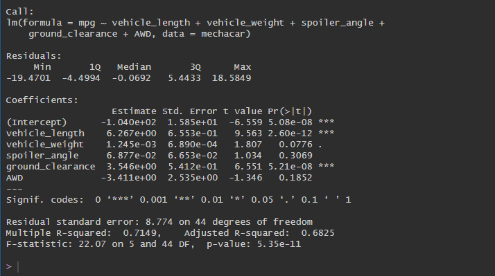
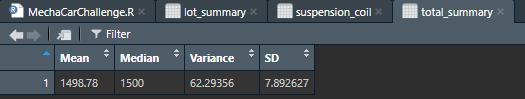
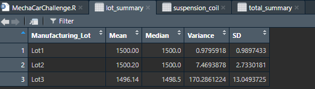
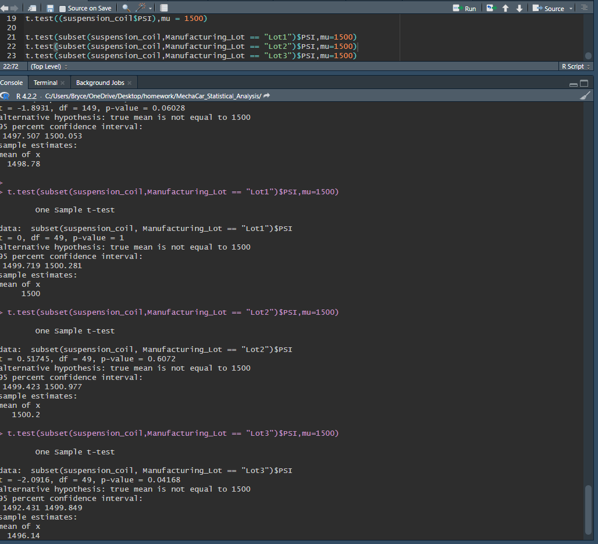

# MechaCar_Statistical_Analysis

## Linear Regression to Predict MPG
.
* Which variables/coefficients provided a non-random amount of variance to the mpg values in the dataset?
I believe if I am looking at this model correctly, the coefficients that provided a non random amount would be the Vehicle_weight, spoiler_angle, and AWD.
* Is the slope of the linear model considered to be zero? Why or why not?
No, the slope is not zero.
* Does this linear model predict mpg of MechaCar prototypes effectively? Why or why not?
No, at 68% how could it? There are a lot more things that go into the MPG factor than what is in this data. What about engine type? Tire size? This linear model can come close probably but there are more factors that go into it in my opinion. 

## Summary Statistics on Suspension Coils
.
.

* The design specifications for the MechaCar suspension coils dictate that the variance of the suspension coils must not exceed 100 pounds per square inch. Does the current manufacturing data meet this design specification for all manufacturing lots in total and each lot individually? Why or why not?
They meet the design specification as a whole but as each lot individually lot 1 and 2 meet the specification but lot 3 does not. 

## T-Tests on Suspension Coils
.

According to the T-Tests above it looks like lot 3 is bringing down the P-value of the total combines performance.

## Study Design: MechaCar Vs. Competition
There is still a lot more data needed to see how MechaCar holds up against the competition. What is the cost of these vehicles, what is the safety rating, how much are oil changes and standard maintenance. Out of those thing I feel like cost is very important to people. If MechaCar SUV is 15% cheaper than the competitors, then people will buy Mechacar. The data needed would be fairly easy to come up with. How much are SUV's from competitors like Ford, Chevy, Tesla, Jeep, Toyota, Honda, and of course the cost of Mechacar. After this data is gathered you would need to run some sort of survey to see if people are buying the Mechacar due to price or what draws them to it. Then you will have you're answer, if the cost of SUV's are important to people buying them. 
